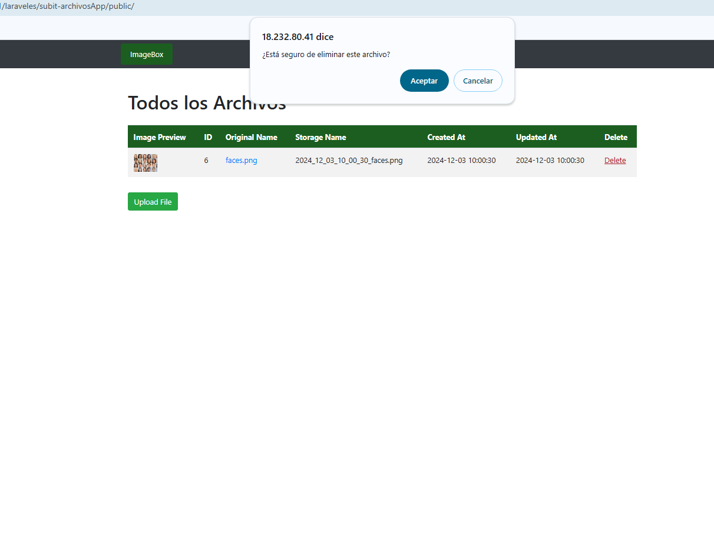
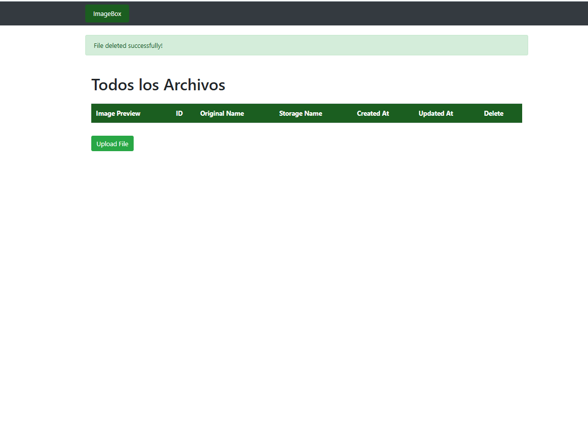
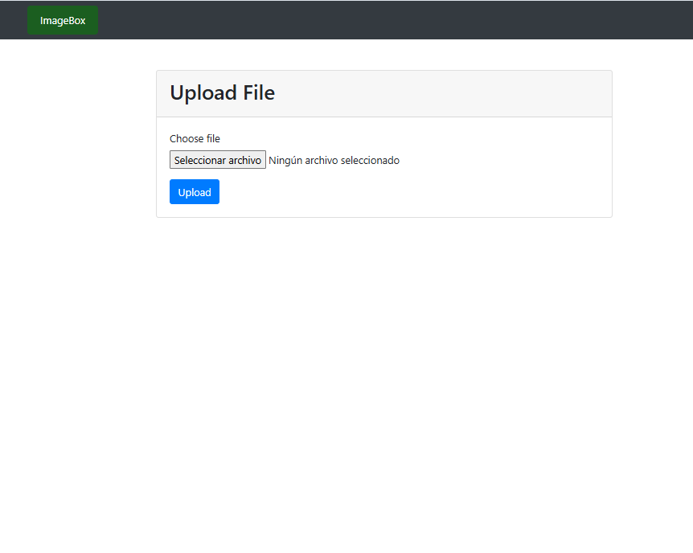
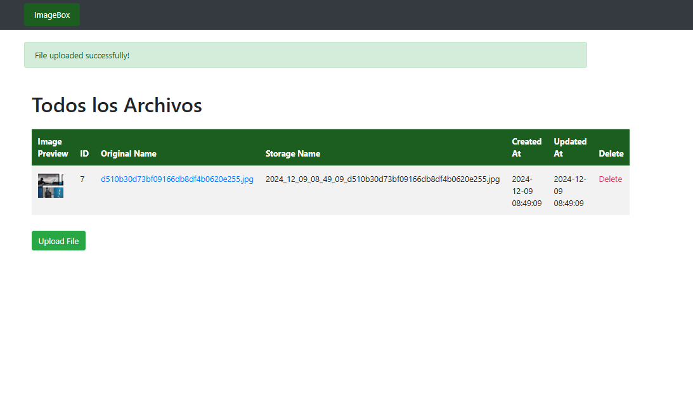

Sistema de Gestión de Imágenes - Laravel

## 📋 Descripción

Aplicación web desarrollada con Laravel para la gestión y visualización de imágenes. Ofrece dos métodos de acceso para obtener imágenes:

Acceso por ID único
Acceso por nombre de archivo
## 🛠️ Tecnologías Utilizadas

Framework: Laravel 11.x
Lenguaje: PHP 8.2
Base de datos: MySQL
Frontend: Blade (Motor de plantillas de Laravel)
Testing: PHPUnit 11.0
⚙️ Requisitos Previos

PHP >= 8.2
Composer
MySQL/MariaDB
Node.js y NPM (opcional, solo necesario para gestionar assets)

## 🚀 Instalación

**1. Instalar dependencias de PHP:**
```bash
composer install
```
**2. Configurar el entorno:**
```bash
cp .env.example .env
php artisan key:generate
```
**3. Configurar la base de datos:**
```bash
DB_CONNECTION=mysql
DB_HOST=127.0.0.1
DB_PORT=3306
DB_DATABASE=archivosSubidos
DB_USERNAME=user_subir
DB_PASSWORD=root
```
**4. Ejecutar migraciones:**
```bash
php artisan migrate
```
**📝 Características**

**Subida de imágenes fácil y rápida.**

Almacenamiento seguro de archivos.
Visualización de imágenes por ID único o nombre de archivo.
Sistema de rutas amigables y bien estructuradas.

## 🔧 Uso

Accede a la aplicación a través de la siguiente URL:

http://18.232.80.41/laraveles/subit-archivosApp/public/

Usa el formulario de subida para añadir imágenes.

Rutas disponibles:

```bash
Route::get('/', [UploadController::class, 'index'])->name('upload.index');
Route::get('/create', [UploadController::class, 'create'])->name('upload.create');
Route::post('/upload', [UploadController::class, 'store'])->name('upload.store');
Route::get('image/{id}', [UploadController::class, 'image'])->name('upload.image');
Route::get('show/{file}', [UploadController::class, 'show'])->name('upload.show');
Route::delete('delete/{id}', [UploadController::class, 'destroy'])->name('upload.destroy');
```

## Capturas de pantalla:






